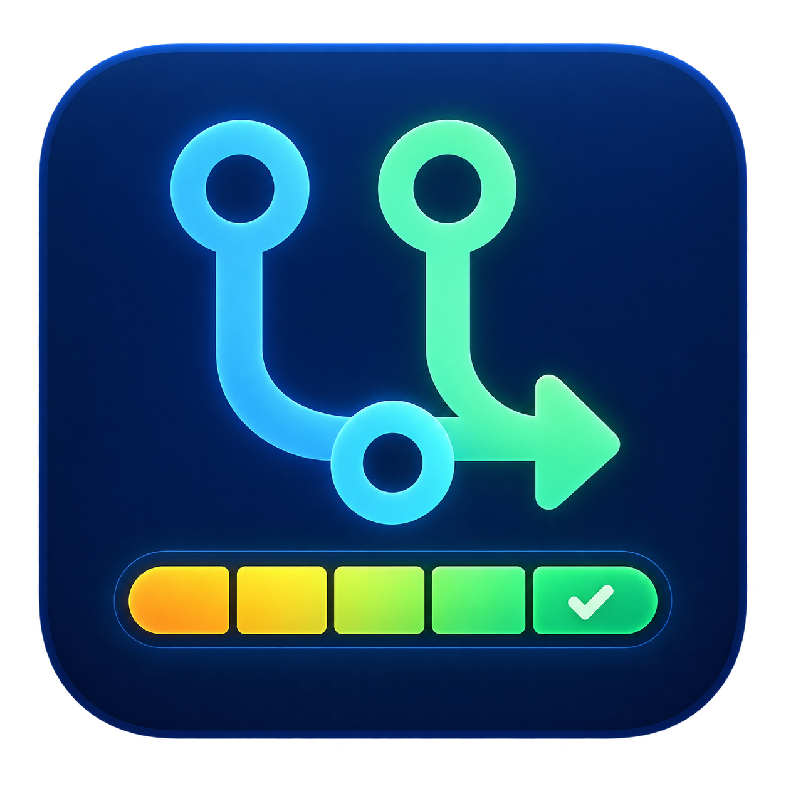
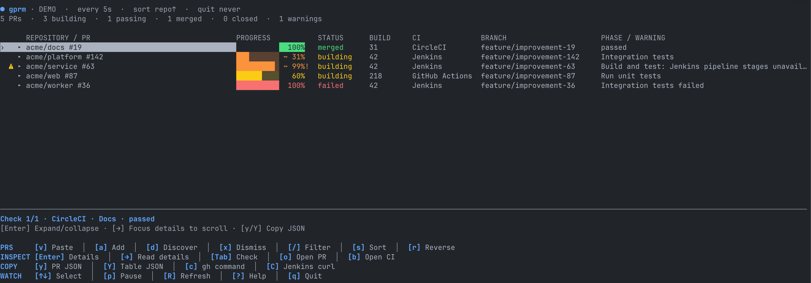

<p align="center">
  
</p>

# github-pr-monitor (`gprm`)

A keyboard-driven GitHub PR and build dashboard, styled after [kube-resource-monitor](https://github.com/mikeoertli/kube-resource-monitor). Paste a batch of PR links, follow their CI checks, and leave with a useful monitoring summary.

- Jenkins build numbers, elapsed-time estimates, active pipeline stages, and superseding builds.
- GitHub Actions run numbers, attempts, and active steps. Other CI providers work through GitHub check runs and commit statuses.
- Fuzzy filtering (including branches and authors), repository/progress sorting, browser shortcuts, and automatic session restoration.
- Expandable PR rows with branch, review, change counts, timestamps, and full PR/CI URLs.
- Visible CI warnings and clipboard export of the selected PR or filtered table as JSON.
- Completed PRs stay visible for 24 hours by default, or until dismissed with configurable indefinite retention.
- Configurable startup and exit behavior; no-check and stale snapshots never count as passing.
- Mixed-provider sessions automatically show a CI column on wide terminals.
- An offline demo that never touches your saved session or calls GitHub/Jenkins.

<p align="center">
  
</p>

## Build and install

Requires Go 1.24.2 or later to build, and an installed, authenticated [GitHub CLI](https://cli.github.com/) for live monitoring. Jenkins uses Go's HTTP client; neither curl nor jq is needed for monitoring. Running a copied Jenkins request requires `curl` on your terminal's `PATH`.

```sh
gh auth login
make build
./bin/gprm --demo
make install
```

`make install` installs `gprm`, `ghprm`, and `github-pr-monitor` into `~/.local/bin`. Set `PREFIX` to change the destination. Ensure the destination is on your `PATH`. `go install ./cmd/gprm` is also supported, without aliases.

## Shell completions

`make build` generates Bash, Zsh, Fish, and PowerShell scripts in `bin/completions`. You can also generate any script directly:

```sh
gprm completion zsh
gprm completion bash
gprm completion fish
gprm completion powershell
```

Completions cover flags, startup modes, auto-quit modes, sort choices, interval/retention examples, and file paths. All three command names are supported. Generating or requesting completions works offline, without `gh`, and does not read or write your config or session.

**Zsh** (the default macOS shell):

```sh
mkdir -p ~/.local/share/zsh/site-functions
gprm completion zsh > ~/.local/share/zsh/site-functions/_gprm
```

Add the following to `~/.zshrc`, with the `fpath` line **before** your existing `compinit` call or shell-framework initialization. If completion is already initialized by your framework, keep its initialization instead of adding a second `compinit` call.

```zsh
fpath=("$HOME/.local/share/zsh/site-functions" $fpath)
autoload -Uz compinit
compinit
```

Start a new shell. To enable completions just for the current session after `compinit` has run: `source <(gprm completion zsh)`.

**Bash:**

First install and load `bash-completion`. For macOS's bundled Bash 3.2, use `brew install bash-completion`; for Homebrew Bash (4.2 or newer), use `brew install bash-completion@2`. Add this before the gprm source line in your Bash startup file:

```bash
source "$(brew --prefix)/etc/profile.d/bash_completion.sh"
```

On Linux, install your distribution's `bash-completion` package and load its initialization script (commonly `/usr/share/bash-completion/bash_completion`) if your shell does not already do so. This dependency supplies the word parsing and file completion helpers used by the generated Bash script.

```sh
mkdir -p ~/.local/share/bash-completion/completions
gprm completion bash > ~/.local/share/bash-completion/completions/gprm
```

Add `source "$HOME/.local/share/bash-completion/completions/gprm"` to `~/.bashrc`. On macOS, ensure your `~/.bash_profile` loads `~/.bashrc`, or add the source line there instead. The script registers all three command names. For the current session only: `source <(gprm completion bash)`.

**Fish:**

```fish
mkdir -p ~/.config/fish/completions
gprm completion fish > ~/.config/fish/completions/gprm.fish
ln -sf gprm.fish ~/.config/fish/completions/ghprm.fish
ln -sf gprm.fish ~/.config/fish/completions/github-pr-monitor.fish
```

Use your Fish configuration directory instead if customized. The alias files allow Fish to load completions even when an alias is the first command you complete. For the current session only: `gprm completion fish | source`.

**PowerShell:** add this line to your PowerShell profile (`$PROFILE`), or run it in the current session:

```powershell
gprm completion powershell | Out-String | Invoke-Expression
```

Alternatively, save `gprm completion powershell` to a `.ps1` file and dot-source that file from your profile.

**Install generated files together:** `make install-completions` installs all four scripts under `$(PREFIX)/share` (default `~/.local/share`), including Bash/Fish alias links. This is separate from `make install` and does not edit shell startup files. For Zsh/Bash, use the setup above; Fish must search `$(PREFIX)/share/fish/vendor_completions.d` in its completion path (or use the per-user installation above). The PowerShell script is installed at `$(PREFIX)/share/gprm/completions/gprm.ps1`.

## Start monitoring

```sh
gprm                                         # restore the last session
gprm --startup clipboard                     # start with PR links in the clipboard
gprm --startup empty                         # start with an empty dashboard
gprm --startup auto-discover                  # discover open and recently closed PRs
gprm -f api                                  # display and poll fuzzy matches for api
gprm --startup auto-discover --filter "api #42" # discovery stays unrestricted
gprm --startup empty acme/api#42 acme/web#87   # explicit PRs only
gprm --auto-quit all-passing --interval 10s
gprm --auto-quit builds-finished acme/api#42
gprm --auto-quit never                        # keep the dashboard open for review
gprm --completed-retention forever           # keep completed PRs until dismissed
gprm --demo                                  # animated, fully offline
gprm --demo --once                           # printable demo snapshot
gprm --once --startup clipboard              # one live refresh and summary
```

Flags can appear before or after PR references. Long options use two dashes (`--help`); short options use one (`-h`). Positional PRs are added to the selected startup mode. URLs can include `/files`, `/checks`, query strings, and fragments; they are normalized to the PR. `owner/repo#123` uses `github_host` from settings. Clipboard import extracts links from prose and Markdown and deduplicates them. `clipboard` startup reads once; press `v` to import again.

`-f` / `--filter` sets the initial fuzzy filter for both the dashboard and PR/CI polling, including `--once`. Matching is case-insensitive; each space-separated term must match a field (repository, PR number, title, branch, author, state, check name/provider, or phase). For example, `--filter "api #42"` combines a repository and PR-number match. The header counts, displayed CI column, and exit summary use the same filter. Saved PRs are preserved, and discovery still finds and saves its normal results.

Press `/` to edit that same filter. Typing previews the rows; `Enter` applies it and refreshes matching PRs, while `Esc` in the editor restores the previous filter. `Esc` in table navigation clears it and resumes polling all PRs. Pausing still prevents automatic refreshes. Requests already in progress may finish after a filter change; the next batch uses the new filter. PRs re-entering the filter must refresh successfully before they can trigger auto-quit.

Matching uses locally available data: repository names and PR numbers are known immediately; titles, branches, authors, and CI details require a previous fetch. An unmatched PR is not fetched just to learn whether its unknown fields would match. Clear the filter to populate that data, or use a repository/number filter on a fresh session. Filters on changing fields such as status stop polling a PR once its last fetched data no longer matches. The filter is per invocation and is not saved in the config or session.

Discovery uses your authenticated GitHub account and searches for authored open PRs plus PRs merged or closed within the retention window. Open PRs get priority under the combined `discovery_limit` (100 by default, maximum 1000). Results are deduplicated and manually dismissed PRs are skipped. With `forever` retention, discovery looks back 24 hours for newly completed PRs while already monitored completions stay indefinitely; `0s` disables discovery of completed PRs. The app reports when the discovery limit is reached. It runs on startup or when you press `d`, not on every refresh.

## Configuration

On the first live run, gprm creates `~/.config/gprm/gprm_config.toml` with documented defaults and permissions `0600`. `$XDG_CONFIG_HOME/gprm/gprm_config.toml` is used when set. Create it ahead of time with:

```sh
gprm --init-config
```

This refuses to overwrite an existing file. `--config /path/to/gprm_config.toml` selects another file. Unknown settings and invalid modes/durations produce an error.

If you previously used `~/.config/gprm/config.toml`, rename it to `gprm_config.toml` in the same directory before the next live run, or keep using it explicitly with `--config ~/.config/gprm/config.toml`. Existing files are not automatically renamed or overwritten. The default template is embedded from `internal/config/defaults.toml`, which also supplies runtime defaults for omitted settings.

```toml
startup = "restore"          # restore | clipboard | empty | auto-discover
auto_quit = "all-closed"    # never | builds-finished | all-passing | all-closed
completed_retention = "24h" # duration since closure | forever | 0s
interval = "5s"
request_timeout = "20s"
sort = "repo"              # repo | progress
descending = false
ci_column = "auto"         # auto | always | never
no_color = false
github_host = "github.com"
discovery_limit = 100

[tools]
gh = "gh"                 # executable name or absolute path
clipboard = ""            # automatic platform default
clipboard_args = []
clipboard_write = ""      # automatic platform default; receives JSON on stdin
clipboard_write_args = []
open = ""                 # automatic platform default
open_args = []

[[jenkins]]
url = "https://ci.example.com/jenkins"
user = ""
token = ""
user_env = "JENKINS_USER"
token_env = "JENKINS_API_TOKEN"
```

Repeat `[[jenkins]]` for more servers. The environment variables named by `user_env` and `token_env` override inline values when nonempty. Credentials are sent only to the configured origin and path prefix. Cross-origin redirects are refused. Use the actual Jenkins server root, including any context path such as `/jenkins`.

Paths and arguments are separate: `clipboard = "/path with spaces/helper"` works; `clipboard = "helper --flag"` does not. Commands are executed directly, without a shell. Defaults are `pbpaste`/`pbcopy`/`open` on macOS, `wl-paste`/`wl-copy` or `xclip`/`xsel` and `xdg-open` on Linux, and PowerShell clipboard/rundll32 on Windows. Configure `clipboard_write` and `clipboard_write_args` separately from the clipboard reader; exported JSON is passed unchanged through stdin. For example, X11 copying uses `clipboard_write = "xclip"` with `clipboard_write_args = ["-selection", "clipboard", "-in"]`. Windows integrations are implemented but have not been tested on Windows. Manual paste into the `a` input works when no clipboard helper is available.

CLI overrides: `--startup` (`-m`), `--auto-quit` (`-q`), `--interval` (`-i`), `--sort` (`-s`), `--gh`, `--completed-retention`, and `--no-color`. Use `--config` (`-c`) to select settings, `--help` (`-h`) for usage, and `--version` (`-V`) for the version. Single-dash long spellings such as `-help` are not accepted. Overrides affect the current run and do not rewrite your settings. Demo mode uses built-in defaults and CLI overrides; it ignores the config file.

## Exit modes

| Mode | Exit when every monitored PR… |
| --- | --- |
| `never` | Waits for you to quit. |
| `builds-finished` | Has at least one check and all currently reported checks have reached a terminal result, including failure/cancellation. |
| `all-passing` | Has at least one check and all currently reported checks are successful, neutral, or skipped. |
| `all-closed` (default) | Is merged or closed, independently of CI results or running jobs. |

Auto-quit considers only PRs matching the active filter. With no filter, it considers the full monitored list. An empty match set never auto-quits. Restored state must be refreshed before it can cause an exit. A GitHub polling error blocks all automatic exits; a Jenkins build polling error blocks the build-related exit modes. Missing optional stage/step details do not override an authoritative build/check result. Pausing prevents auto-quit, and adding/importing PRs postpones it until a subsequent refresh.

“All passing” covers all reported checks, not just branch-protection-required checks. PRs without checks show their mergeability, but do not satisfy the build-related exit modes; `all-closed` still follows the PR lifecycle. Polling cannot predict checks that a provider has not registered yet or reruns started after the last snapshot. Once a build-related mode exits, it cannot observe future reruns.

## Completed PR retention

Merged and closed PRs remain in the table for **24 hours after GitHub's merge/close timestamp** by default, independently of their CI result. Passing checks on an open PR do not start this timer. If GitHub omits the closure timestamp, the monitor uses the first time it observed the closure and persists that time across restarts. Expanded details show when a completed row will expire.

Set `completed_retention = "forever"` to keep completed PRs until manually dismissed, or choose another Go duration such as `48h` or `168h`. `0s` hides completed rows at the next successful refresh. `--completed-retention` overrides the setting for one run. Expiration happens after a successful refresh so reopened PRs and snapshots with fetch errors are not discarded based on stale state.

Press `x` to dismiss a row sooner. Dismissals are remembered by `restore`, `auto-discover`, and subsequent `d` discovery actions; a dismissed PR will not keep reappearing. Pasting or explicitly adding that PR again clears its dismissal (the configured retention window still applies). Expired and dismissed PRs remain in the current run's exit summary. Restoring or auto-discovering keeps previously monitored completed PRs until their retention expires; `empty` and `clipboard` start fresh sessions.

Retention preserves dashboard rows and saved history; it **does not delay auto-quit**. The default `all-closed` mode still exits when every monitored PR is merged/closed, saving retained rows for the next launch. Use `--auto-quit never` (or `auto_quit = "never"`) when you want the dashboard to stay open so you can review completion.

## Keys

| Key | Action |
| --- | --- |
| `v` / `Ctrl+V` | Add all PR links from the clipboard |
| `a` | Type or paste one or more PR URLs or `owner/repo#123` references |
| `d` | Add your open and recently closed PRs |
| `↑` / `k`, `↓` / `j` | Select a PR |
| `PgUp`, `PgDn`, `g`, `G` | Page or jump to the first/last PR |
| `Enter` / `Space` | Toggle inline PR details |
| `→` | Focus the selected PR's details (expands them if needed) |
| `←`, `Esc` | Close focused details and return to the table in one press; `←` also collapses inline details |
| `Tab`, `Shift+Tab` | Next/previous CI check in the selected PR |
| `↑`, `↓`, `PgUp`, `PgDn`, `Home`, `End` | While details are focused: scroll, page, or jump to the start/end |
| `y`, `Y` | Copy selected PR JSON or all PRs in the filtered table |
| `c`, `C` | Copy a gh PR view command or a Jenkins build curl command |
| `/`, `Esc` | Fuzzy filter; clear filter when in table navigation |
| `s`, `r` | Switch repository/progress sort; reverse direction |
| `p`, `R` | Pause/resume; refresh immediately |
| `o`, `b` | Open the selected PR or selected check's build URL |
| `x` | Dismiss a PR; remember the dismissal and keep it in this run's summary |
| `?` | Show help |
| `Q` / `q` / `Ctrl+C` | Quit and print the summary |

The footer groups shortcuts under **PRS**, **INSPECT**, **COPY**, and **WATCH**, with bold colored headings and keycaps, bright descriptions, and muted separators. With colors disabled, uppercase headings and separators preserve the grouping. The table grows with the terminal: branch appears from 140 columns and title from 190 columns, while repository and phase columns use the remaining width. Compact windows prioritize repository, progress, and status; `?` lists every shortcut.

Press `Enter` to expand a PR beneath its table row. Details include source/target branches, author, draft state, review decision, mergeability, additions/deletions, file/commit/conversation-comment counts, timestamps, head commit, PR URL, and CI check details including the CI URL. These fields come from [GitHub's pull request API](https://docs.github.com/en/graphql/reference/pulls#pullrequest). Expansion is retained per PR while sorting and filtering, for the current run. Long text and URLs wrap. Press `→` on a selected PR to focus its details; `↑`/`↓` then scroll the content, `PgUp`/`PgDn` move by a page, and `Home`/`End` jump to the start/end. The PR row stays visible above the details, with a line range and `↑ more` / `↓ more` indicators. Press `←` or `Esc` once to close focused details and return to table navigation, keeping the same PR selected and preserving your filter. Focus stays with the same PR during sorting and refreshes. `/` always opens filtering.

PR lifecycle is independent of CI success: merged and closed PRs take precedence in the status column and are counted separately in the header. Explicit GitHub merge/closure fields drive this state and the `all-closed` exit mode. Mergeability is shown as `n/a` after closure. Older PR metadata and responses that would revert a merged PR to open are flagged as stale instead of replacing the displayed snapshot.

The details label **GitHub data updated** with GitHub's own `updatedAt` timestamp, alongside merge/closure timestamps when available. **Last successful data fetch** records when that PR's GitHub response was received, not when the UI applied the batch or when a refresh was attempted. On a failed refresh, these timestamps stay unchanged and a separate **Last attempt (failed)** line identifies the failure. An old GitHub update time means that metadata has not changed; by itself, it does not mean polling has stopped. CI results can change independently of PR metadata.

The table shows the first active check (or the first check when all are finished). `Tab` and `Shift+Tab` select a check for the expanded details, bottom summary, and `b` browser shortcut. `o` always opens the selected PR on GitHub. These actions also work with the row collapsed.

A **⚠** on the left flags a reported check with a missing/invalid build URL, a failed CI detail lookup, or a failed PR refresh. The issue appears in the phase/warning column and the selected-row summary; expand the row for all warning messages and full URLs. A PR with no reported checks does not produce a missing-URL warning. Other providers' links are checked for URL validity; their websites are not probed for reachability.

`y` copies a JSON object for the selected PR; `Y` copies an array for the current filtered table in its current sort order, including rows outside the viewport. Clear the filter first to copy all monitored PRs. Both include all current checks and metadata, even when details are collapsed. These are normalized dashboard snapshots, not raw provider responses or historical runs. Freshness, last-attempt/last-success timestamps, warnings, and errors identify retained data after a failed refresh. Timestamps use RFC 3339; job durations are nanoseconds. Configuration and credentials are excluded. Clipboard failures appear in the status line.

 `--no-color` disables all color and text styling while keeping a plain selection marker. Set `no_color = true` in the config for this default; `--no-color=false` overrides that setting for one run. The `NO_COLOR` environment variable and `TERM=dumb` also disable styling and take precedence over the flag.

### Copy runnable requests

The **Copy** menu provides commands ready to paste into Bash, Zsh, or another POSIX shell:

- `c` copies one `gh pr view <PR-URL> --json <fields>` command, using your configured `tools.gh` path. It requests the full PR field list, including mergeability, merge state, reviews, and `statusCheckRollup`. The PR URL selects the repository and GitHub host; authentication stays with `gh`.
- `C` copies one `curl -s` command for the selected Jenkins build's `/api/json` endpoint. Use `Tab` to choose a different check. Report links are normalized to their parent build. For example:

```sh
curl -s -u "$JENKINS_USER:$JENKINS_API_TOKEN" https://ci.example.com/job/api/17/api/json
```

The credential variable names come from the matching Jenkins server configuration. Environment secrets remain references in the copied command; inline credentials are quoted when configured, and inline fallbacks use shell parameter expansion. Credentials are attached only when the build matches that server's origin and path. Public/unconfigured servers produce a command without `-u`.

These commands make a fresh request for the selected PR or build. They are inspection shortcuts: the monitor separately retrieves paginated checks, pipeline stages, and historical timing data. Use `y`/`Y` for the exact displayed snapshot with estimates and freshness/error fields. Copying a command does not execute it.

## CI behavior and progress

GitHub is queried through `gh api graphql` with pagination for all check contexts on the current PR head. A changed head during pagination invalidates that snapshot. Polling runs asynchronously with at most four PRs being fetched concurrently, keeping the interface responsive. The default interval is five seconds; an in-flight refresh is never overlapped by a second refresh of the same set.

**PRs without checks:** the status column and exported JSON report GitHub's merge readiness: `mergeable`, `conflicts`, `draft`, `blocked`, `behind`, or `unknown`. The phase explains the result, and the progress column shows `—`. Draft/review requirements and `mergeStateStatus` prevent a conflict-free but blocked PR from being labeled ready. Merged/closed PRs retain their lifecycle status. Unknown mergeability stays unknown and is refreshed normally; a fetch failure remains a warning. No synthetic CI check or passing build is created.

**Jenkins:** numbered build URLs such as `https://ci.example.com/job/api/job/PR-42/17/` and report links beneath that build are supported, including `/17//coverage`, `/17/testReport/`, and `/17/display/redirect?page=tests`. Report paths, query parameters, and fragments are removed before requesting `/17/api/json` and optional `/17/wfapi/describe`; copied curl commands use the same normalized endpoints. Encoded branch names and Jenkins context paths are preserved. Build numbers are read from the URL before the request, then verified by Jenkins when available, so a lookup error does not leave the build column blank. Direct, display, coverage, and test links to the same build are counted once, so completed reports do not inflate progress while the build is still running. When a build overview check is available, its GitHub status is preferred over report statuses for fallback if Jenkins cannot be reached. Non-build links fall back to the GitHub-reported status with an explanatory detail message. A direct build URL, configured server match, or Jenkins check/provider name identifies Jenkins.

Time estimates prefer the same job's last successful duration, falling back to Jenkins's `estimatedDuration`. Estimates are marked `~`, cap at 99% while running, and display overruns in the phase. Jobs without timing information show unknown progress. Aborted/not-built runs may follow `nextBuild` within the same job, with a bounded chain. Pipeline stages require the [Pipeline REST API plugin](https://plugins.jenkins.io/pipeline-rest-api/); its absence does not prevent build monitoring.

Progress bars are red below 25%, orange from 25%, yellow from 50%, and green from 75% through completion. A running build that exceeds its expected runtime turns orange, then red at 25% overdue. The percentage stays capped at 99% until the build finishes; `!` marks an overdue estimate even with colors disabled. If a PR has several checks, its bar uses the worst active overrun. Completed failures stay red, and unknown or stale progress is muted. The offline demo includes an overdue build.

**GitHub Actions:** active job steps and completed-step progress come from the Actions API; build numbers show the workflow run number and rerun attempt (for example, `42.2`). Workflow names distinguish identically named jobs. If job details are unavailable, GitHub's check status remains available.

**Other providers:** provider name, check name, status, and build link come from GitHub. Running percentage is unknown unless the provider exposes supported detail data. Finished checks show 100%, including failed checks: the bar indicates completion, while the status indicates outcome. Generic providers do not promise stage names or numeric build numbers. PR progress averages check progress only when every check has a known value; otherwise it shows `—`.

## Saved sessions and exit summary

Sessions are written atomically, with permissions `0600`, to `~/.local/state/gprm/session.json` (or `$XDG_STATE_HOME/gprm/session.json`). `--state /path/to/session.json` allows separate named sessions. Use different state paths for concurrent monitors. A corrupt saved session produces an error instead of being overwritten during restore.

`restore` keeps PRs, observed run history, accumulated monitoring time, retention clocks, and dismissals. `auto-discover` keeps saved completed PRs and dismissals while discovering the current open/recently closed set. `empty` and `clipboard` start fresh sessions and replace the saved session. Dismissed and expired PR rows appear in the current exit summary but are not restored. The app checkpoints periodically and after changes, then saves again on normal quit, Ctrl+C, or SIGTERM.

The summary includes each PR and CI job, distinct **observed** run counts, accumulated time monitored, and final PR/build status. Repeated polls of the same run do not increase the count. Counters persist through restoration and do not add time while the app is closed. Generic status providers that reuse a URL and expose no run identity cannot reliably distinguish reruns; counts are therefore observational, not a complete historical audit.

A merge observed while monitoring may be labeled **merged with failing checks**, **merged with pending checks**, or both. The label is retained even if CI later finishes. This describes the checks at the first observed merge transition, not proof of an administrative bypass. A PR already merged when first added is simply `merged`; merges missed between polls cannot be reconstructed exactly.

## Development

```sh
make test                  # includes the race detector
make check                 # formatting, go vet, and tests
make build
```

`VERSION` is the sole source of the application version. It is embedded at compile time for Make builds and direct `go build`, `go install`, and `go run` commands. To change the version, edit `VERSION` and rebuild; `gprm --version` reports the embedded value. No version flag, Make variable, or linker override is needed.

Tests cover startup/config overrides, paginated GitHub results, changed PR heads, CI fallbacks, Jenkins credential scoping/redirects, superseded builds, estimates, run counting, merge observations, auto-quit semantics, session restoration, and terminal-size handling. They use fixtures and a fake HTTP transport; live Jenkins credentials are not needed.
